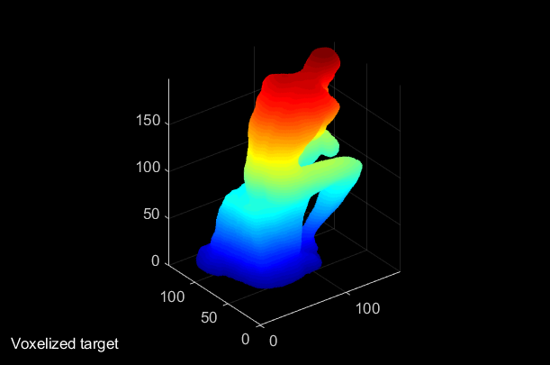
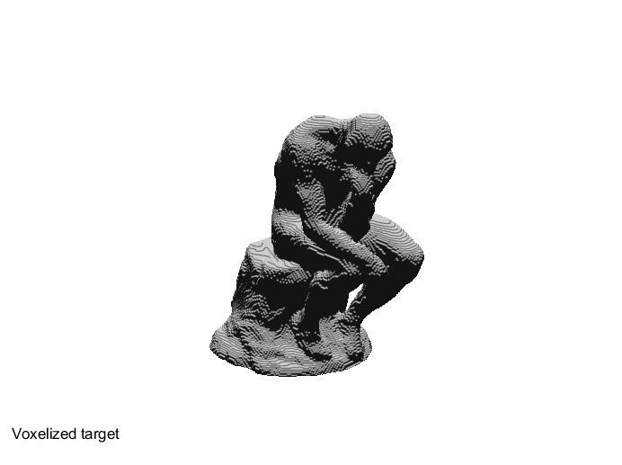

# CAL-software
This README describes how the CAL projection-generation and projector-control code should be used. 
This code has been developed in Matlab 2018b, and 2019a and is compatible, to our knowledge, with 2017a and newer versions. 


## Projection Optimization
The optimization code consists of the main script (main_optimize.m) and supporting functions:
```
voxelize_target.m
initialize_projections.m
optimize_projections.m
find_threshold.m
find_scale.m
get_voxel_count.m
show_projections.m
```

### Steps of main_optimize.m:
Define parameters - all system and optimization parameters are defined with params struct
-The target should be defined by naming an STL file with params.stl_filename or directly assigning a 2D or 3D matrix to the fields, params.target_2D or params.target_3D.
-The optimization parameters are then assigned. These will need to be tweaked to change the step size and convergence depending on the trial and error results of optimization. 
We have had good results with 50-90 iterations, memory of ~80-90%, and learning rate of ~0.001-0.01.

1. voxelize_target is called which will handle voxelization of an STL file if defined
and creation of the target_care_area which is a slightly dilated version of the target matrix. 
2. intialize_projections is called to create an initial guess of the projections to be 
optimized. The initial guess is created with a ramp-filtered negative-truncated projection.
3. optimize_projections is called to optimize the initial projections. params.max_iterations
sets the maximum number of iterations and if defined params.tol sets the error tolerance
for the optimization
4. show_projections displays the optimized projections in sequence





## Projector Control
The projector control code consists of the main script (main_projector_control.m) and
supporting functions:
- create_projection_set.m
- project.m

### Steps of main_projector_control.m:
Define parameters - all system and projection parameters are defined with the params struct
1. create_projection_set is called to convert the optimized projections into a set of modified images based on the input parameters that can be projected.
2. project is called to project the projection_set images at the refresh rate determined by the defined rotational velocity

## NOTES:
-VOXELISE.m, COMPUTE_mesh_normal.m, and CONVERT_mesh_format.m inside the STL_read_bin, were obtained from the Matlab file exchange and were written by Adam H. Aitkenhead (adam.aitkenhead@christie.nhs.uk) at The Christie NHS Foundation Trust.

-The parfor (parallel for loop) function used in initialize_projections.m and optimize_projections is part of the Matlab Parallel Computing Toolbox (https://www.mathworks.com/help/parallel-computing/index.html). 
If parallel computation is desired to speed up optimization for large targets and the “params.parallel” is set to 1 to activate parallel computation this toolbox must be installed.

-The pcshow function used in voxelize_target.m and optimize_projections.m is part of the Matlab Computer Vision Toolbox (https://www.mathworks.com/help/vision/index.html). 
If pcshow is chosen as the volume viewer by setting “params.vol_viewer” to “pcshow” this toolbox must be installed.

-The volshow function used in voxelize_target.m and optimize_projections.m is part of the Matlab Image Processing Toolbox (https://www.mathworks.com/help/images/index.html). 
If volshow is chosen as the volume viewer by setting “params.vol_viewer” to “volshow” this toolbox must be installed.

-The calibration intensity curve included in the repository (intensity_sorted.mat) is that of the Lightcrafter PRO4500 405nm projector that is used in our lab. 
For best results this calibration curve should be replaced with a curve representing the projector that is used in the setup. A simple arbitrary units intensity calibration
can be done by recording the intensity for each bit value of the projector. For 8-bit grayscale projection, this corresponds to 256 intensities. 

-The project.m function uses the third-party Pyschtoolbox (http://psychtoolbox.org/) for control of an auxiliary screen through HDMI or display port. 
To use the project.m function this toolbox must be installed. Also, the screen which the projector is detected as should be defined as Screen 2 within Windows. 
